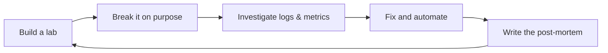

# Sarvesh Nand

### DevOps & Cloud Engineer in Training
**Linux · Docker · CI/CD · Infrastructure as Code · Monitoring**

Backend-trained, infrastructure-minded. I build, deploy, break, and debug systems, then write down what I learned.

  
  
  

---

## 👋 About

I'm a BCA graduate from Uttar Pradesh, India, building a career in DevOps and cloud engineering.

I started in backend development (Python, Java, SQL), so I understand what developers ship and why things break in production. Now I'm focused on the other side: **how software is built, deployed, monitored, and recovered.**

I learn by building a lab, breaking it on purpose, diagnosing it from logs and metrics, and publishing the post-mortem.

---

## 🔧 Skills

**Working knowledge**

**Building hands-on right now**

**Development background:** FastAPI, Spring Boot, REST APIs, and PostgreSQL, so I understand the applications I deploy.

<!-- UPDATE: move a badge from "Building" to "Working knowledge" only when you can explain it in an interview. -->

---

## 🧪 My Home Lab

Everything runs locally on Linux Mint (no cloud bill), using:

| Layer | Tools |
|---|---|
| Virtualization | VirtualBox / KVM, Ubuntu Server VMs |
| Containers | Docker, docker-compose |
| Orchestration | k3s / kind |
| CI/CD | GitHub Actions |
| IaC & configuration | Terraform (local providers), Ansible |
| Observability | Prometheus, Grafana, Loki |

I map each lab piece to its AWS / Azure / GCP equivalent, so the concepts carry over to the cloud.

---

## 📌 Projects

| Project | What it demonstrates | Status |
|---|---|---|
| **CI/CD Pipeline** | Test → build → scan → deploy with rollback, using GitHub Actions and Docker | 🚧 In progress |
| **Infrastructure as Code Stack** | Rebuild a multi-service environment from scratch with Terraform and Ansible | 📅 Planned |
| **Monitoring & Incident Lab** | Dashboards, alerts, and blameless post-mortems of failures I caused on purpose | 📅 Planned |
| **Kubernetes Deployment** | Helm, autoscaling, probes, and a cloud-service mapping table | 📅 Planned |

<!-- UPDATE: replace each project name with a link to its repo as soon as it exists, and change the status. -->

**Also in public**
- 📓 `linux-notes`: daily notes from my Linux learning
- 🕵️ `sadservers-writeups`: broken-server puzzles with symptom → investigation → cause → fix

---

## 🔄 How I Work

---

## 🧠 Engineering Principles

1. **Understand before automating.** Automation of something I don't understand is just faster failure.
2. **Everything reproducible.** If I can't rebuild it from a repo, it isn't done.
3. **Failures are normal.** Systems should be observable, recoverable, and documented.
4. **Least privilege, no secrets in Git.** Security is part of every project.
5. **Use AI, verify AI.** I use AI tools to move faster, but I read, test, and explain every line I commit.
6. **Concepts outlast tools.** Networking, Linux, and debugging stay useful as tools change.

---

## 📚 Learning Roadmap

- [x] Git, GitHub, Python, Java, SQL, backend fundamentals
- [ ] Linux administration and networking fundamentals
- [ ] Docker and docker-compose
- [ ] CI/CD with GitHub Actions
- [ ] Terraform and Ansible
- [ ] Monitoring, logging, and incident response
- [ ] Kubernetes fundamentals
- [ ] Cloud concepts (IAM, networking, compute, cost)

<!-- UPDATE: tick items as you finish them, and keep the list honest. -->

---

## 🎯 Open To

**DevOps Engineer (Junior / Associate / Trainee) · Cloud Support Engineer · Site Reliability Trainee · Platform / Infrastructure Engineer (Junior) · Linux / Systems Administrator · Production Support / NOC Engineer · DevOps Intern**

📍 India · 🌎 Open to remote · ⏱ Ready to take ownership, learn fast, and handle on-call responsibilities

---

## 🎓 Education

**Bachelor of Computer Applications (BCA)**, Veer Bahadur Singh Purvanchal University, 2023 to 2026

---

## 📫 Let's Connect

I'm looking for my first role on a team running real systems. If you're hiring, or you're an engineer willing to give feedback on a project, I'd love to hear from you.

*Build. Break. Diagnose. Fix. Document. Repeat.*

